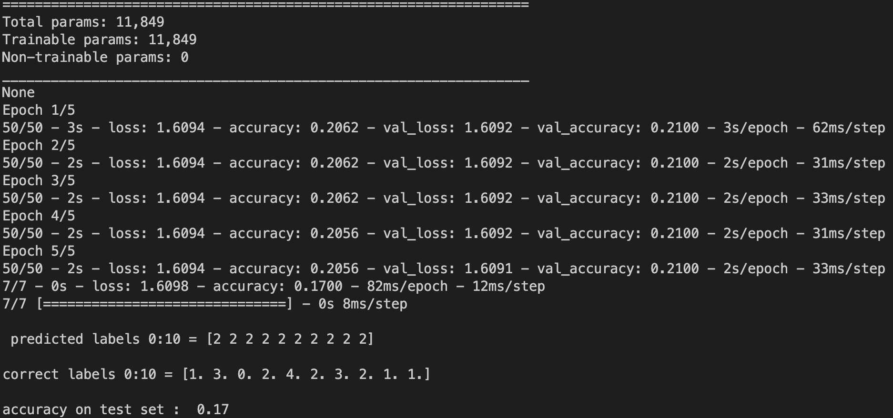

# Scope

This project aims to use convolutional neural networks (CNNs) in order to predict one texture feature of a given image texture. The dataset consists in a batch of generated textures sampled from the anisotropic fractional Brownian random field model using the `pyafbf` python package. More details about the project, the implemented neural networks and the results are provided in the "Classification of Image Textures Using Convolutional Neural Networks" section below. Most of the information included in this section are taken from papers [1] and [2].

# Dataset

The present project uses the dataset published in a kaggle project by F.Richard [2].

# Virtual environment

The present project is provided within a virtual environment. To work on the corresponding `venv`, run the following command in the parent folder of `pyafbf`: `source bin/activate`

# Run specific files

To run specific files, please place yourself in the project and use python3 command line. Example: `python3 application_set001_feat1`.

Scripts to run in order to get the prediction results of the 4 used NNs (detailed below) to predict the feature of interest (first column in `features_set001.csv`) are localized in the `application_set001_feat1`. Other applications with other neural networks were developed and used (and returning wick results) are in the `applications_others` folder.

# Classification of Image Textures Using Convolutional Neural Networks

# Introduction

Image analysis is the process of extracting meaningful information from digital images. It involves using various techniques, such as image processing, computer vision, and machine learning, to extract features from an image, analyze the image content, and make decisions based on the image data.

In image analysis, texture analysis plays an important role in a variety of applications. In fact, texture analysis is particularly useful for identifying patterns or structures that are not easily visible to the human eye. Some examples of applications where texture analysis methods are used include medical imaging.

For instance, texture analysis has been widely used for the detection of lesions in mammograms [1]. Mammograms are x-ray images of the breast used to detect breast cancer. Texture analysis is a useful tool for this task because it can extract information about the patterns and structures in an image, which can be used to differentiate between normal and abnormal tissue.

Statistical properties of intensity values in mammography images are commonly used for texture analysis. These methods can extract features like tissue homogeneity or isotropy, which can train machine learning models to distinguish between normal and abnormal tissue.

In some medical images, such as mammograms, texture analysis can be approached through the lens of random field models. One such model is the anisotropic fractional Brownian field, which is a non-stationary Gaussian field commonly used in biomedical applications for modeling image textures [1].

As mentioned in [1], the **probability distribution** of an anisotropic fractional Brownian field Z is determined by a semi-variogram of the form:

It is characterized by two parameters/functions called the topothesy (tau) and the Hurst function(beta). In this presentation, we will focus only on the Hurst function parameter.

The Hurst function is defined on the domain [0; pi] and is comprised between 0 and 1 [2].
The Hurst function is a key point for the characterization and the classification of image texture [1]. In fact, the minimum value of the Hurst function tells as about the irregularity/roughness of the texture of a given image. Moreover, the length of the argmin set of the Hurst function [0; pi] reflects the directional properties of the image texture, whereas the center of the argmin set of the Hurst function, ranging between (-pi/2, pi/2), will inform us about the orientation of the texture when it is anisotropic.

With this in mind, our present work aims to estimate these features derived from the Hurst function from a given image.

Concretely, we propose different Neural Networks (NNs) in order to estimate these parameters.

Our dataset consists in 20,000 synthetic textures available in the original kaggle project [2]. The generated textures are sampled from the anisotropic fractional Brownian random field model using the python package `pyafbf`.

In order to avoid loading the 20,000 images each time, we managed to convert this dataset into `.npz` files (see `data_utils.py`). For example, the `database/feature_set001_feat0.npz` encloses both the list of the 20,000 synthetic textures and the corresponding value of the feature number 1 (column 1 in `features_set001.csv`). This feature corresponds to the length of the argmin set of the Hurst function.

Precisely, the `database/feature_set001_feat0.npz` returns 4 different elements: the training set images (18000 images) and their corresponding feature values as well as the test set images (18000 images) and their corresponding feature values. The training and the test set are obtained y splitting the dataset into two non overlapping groups: the training set (18000 images) and the test set (2000).

**Here we only focus on predicting the length of the argmin set of the Hurst function of the first dataset images.** Note that some work has been done on to predict the other features on both the first dataset `features_set001.csv` and the second dataset `features_set002.csv` (see `applications_others/*`). But due to weak results, we made the choice to focus on predicting one single feature of one single data set.

# Methods

To predict the length of the argmin set of the Hurst function of the first dataset images, we first started by turning the prediction problem into a classification problem by classifying the images in one of the 5 classes depending on the value of the feature as follows: 

## Ourmodel CNN

To predict this feature value, we first started by developing a convolutional neural network (CNN) that we called `ourmodel`. After running several times the NN and tried multiple configurations, we came out with the following architecture which returns the best results that get:

###### architecture:

###### results:

###### loss function value at each epoch:

## Three other CNNs

Next, we searched for the best neural networks that are known to have good performances in image texture classification problems.
According to a 2022 study titled "Deep Learning Approaches to Image Texture Analysis in Material Processing" [3], three of the best image texture classification models are AlexNet, mobilenet_V2 and ResNet50.

In this context, we implemented the AlexNet from scratch and used already implemented NNs in keras for the mobilenet_V2 and ResNet50.

### 1) Alexnet

the AlexNet NN is a known architecture for any object-detection task.
It consists of 8 layers, including five convolutional layers and three fully connected layers, with a total of about 25 million parameters.

###### architecture:

###### results:

###### loss function value at each epoch:

#### 2) ResNet50

the ResNet50 is a 50-layer convolutional neural network enclosing 48 convolutional layers, one MaxPool layer and one average pool layer with a total of about 25 million parameters.

###### architecture:

###### results:

###### loss function value at each epoch:

### 3) mobilenet_V2

the mobilenet_V2 is based on a technique called inverted residual blocks. The total number of parameter here is about 3.5 million.

###### architecture:

###### results:

###### loss function value at each epoch:

# Results
As shown in the "results" section, we did not succeed in obtaining good results. The accuracies of each of the used models are around 20% which corresponds in reality to the ratio of one class over all classes (1/5 * 100).

When applying the alexnet, resnet50 and the mobilev2 NNs, we know that the number of parameters is exceeding by far the number of images in our data set (18,000 images vs millions of parameters). But we used this project mainly to learn how to build convolutional neural networks and how to implement already existing NNs from scratch or by using `keras` algorithms.

# Discussion
As we are running these algorithms on our computers, we limited ourselves on very little numbers of epochs. One idea to go further may be to use cloud platforms to run the NNs with high number of epochs.

Another idea would be to increase the number of images in our database. This is possible by generating new synthetic textures using the `pyafbf` package or by including a data augmentation method from an epoch to another. This way, we will increase our dataset which will probably lead to better results. In fact, deep learning is known to return good results only for huge datasets.

Also, one can use other techniques than CNNs such as random forest to predict the value of the feature of interest given the dataset.

# References
[1] Paul Escande, Frédéric Jp Richard. Full inference for the anisotropic fractional Brownian field. 2023. ⟨hal-03922324⟩

[2] Frédéric Jp Richard. [Kaggle project](https://www.kaggle.com/datasets/frdricrichard/pyafbf-textures-set-001?datasetId=2667211)

[3] Liu X, Aldrich C. Deep Learning Approaches to Image Texture Analysis in Material Processing. Metals. 2022; 12(2):355. https://doi.org/10.3390/met12020355
